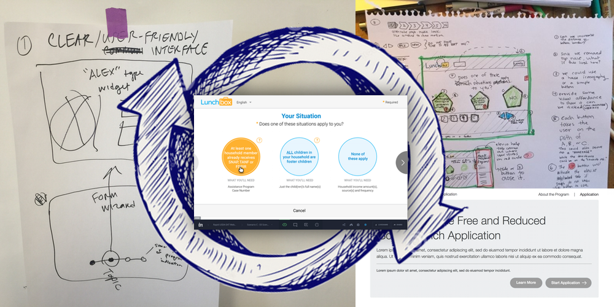

# Executive Summary
### Booz | Allen | Hamilton
#### Project LunchBox - Submission to USDA EAT UX Challenge
------------------------------------------------------

## Overview (The Pitch)
30 million children participate in the free and reduced-price school lunch program every day. However, the application process is paper based and cumbersome making it challenging for applicants to receive the benefits they need. 2014 saw 5 million __paper applications__ submitted, so clearly there's a need to make this easier to apply and efficient to process. How do we make this process easier? To ensure that everyone who is eligible can benefit, we developed a web-form that makes it easy to apply quickly and accurately. Lunchbox is a free online application that uses plain language to reduce user error, features help text to answer applicants’ questions as they go, and provides completed applications to school administrators, thanks to input validation that doesn’t allow you to submit unless you’ve accurately entered all the necessary information.

#### Watch More Here: [Video Link](Video Link)   or  Try It Here: [Demo Link](Demo Link) 

###### [ [BACK HOME](../README.md) ]

------------------------------------------------------

## Our Inspiration
The opportunity to ease the pain. We were inspired by the stories of the schools and parents that interface with the application process – and shocked at the paper pushing challenges existing in the internet era. Designing for and with the user enabled us to bring our theoretical prototype into a working product that put usability – ease of learning, decrease in errors, and increase in reporting – first.

Additionally, the challenge to transform digital government experience. We were inspired to change the pace at which government can bring services and products to their citizens. The hackathon approach worked well with our love for rapid prototyping and testing things fast with real users. As consultants, we get to tackle a variety of complex problems for government 

## Our Approach
We rapidly prototyped this solution at light speed in __7 team working sessions__ over __3 weeks__.  Our _Rapid Solution Sprint_ is a very creative and iterative process in which we focus on deep empathy and understanding of end users and constantly build, test, to learn, validate, and inform the end solution as it evolves.  The major components of this process are; 1) Defining the Challenge,  2) Empathy and User Research, 3) Collaborative and Insightful Ideation 4) Testing for Validation  5) Iterative Agile Development  6) Road-mapping Towards the Future Vision.

[Read More on Our Story Here](our-story.md)

## Key Features of Our Solution
The National School Lunch program impacts the day-to-day lives of millions of Americans, so data accuracy and ease of use for both families and school administrators is critical. With these goals in mind, we included the following distinguishing features that address our users' pain points, pulled directly from our interviews and empathy research:

* __Plain language:__ Our form uses simple, conversational language that removes a lot of jargon that might have confused users. Plus, we wanted people to be able to translate this text into other languages, and the plain language ensures that nothing is lost in translation. 

* __Help Text:__ Our form also includes help text throughout the application that explains terms and requirements. This encourages applicants to provide accurate information, and also comforts those who don't have (or don't feel comfortable) sharing information like their social security number or race. 

* __Share button:__ After talking to school administrators and potential applicants, we learned early on that just finding the application can be the hardest part. So we added a share button that makes it easy for school administrators, family, or friends to send the form to others who may benefit.  

* __User behavior-tracking analytics:__ Our application can easily connect with an analytics platform. This gives the system owner the ability to track user behaviors within the form and constantly adapt the experience, based on those behaviors. 

* __Customizable Style & Themes:__ A more subtle feature is how we used Bootstrap to style our form. Since we know most schools will want to make the form match their colors and existing sites, Bootstrap enables them to quickly change the look and feel through themes and easy to update code.   

* __Easy to maintain/add new features:__ Another back-end feature is that we used MVC or model view controller as the framework for our form. It may seem complicated, but it just means that the application is easy to maintain. It enables the system owner to easily update the look, connect to third-party applications, and customize data storage. 

## What’s Under the Hood
We leveraged open source technologies to power the solution and used widely adopted platforms such as LAMP stack (Linux Apache MySql PHP) so that it can be easily integrated into existing school IT services.  The modular API architecture and backend validations ensure that the application can easily be customized, extended, and maintained.  The reference cloud hosting architecture utilizing Amazon Web Services also allows the solution to scale and increase performance while limiting unnecessary hosting costs.  This also provides a continuous development and integrations DevOps process so that updates and new features can rapidly be deployed.

[Read More on our Technical Guide Here](technical-guide.md)

## Challenges We Ran Into
One of the biggest challenges we faced was around understanding the complexity of the requirements. What initially looked like fairly simple parameters proved difficult to decipher and limiting when it came to reconciling these requirements with our design and usability aspirations. We responded to the challenge by carefully designing components to educate both user groups and continually iterating upon our design; both of these initiatives were informed by our comprehensive focus on user research and interviews.

## Accomplishments That We're Proud Of
As a team spread across a fairly large geographical region, with multiple client commitments competing for our time, we were proud to be able to go from exploring the challenge parameters to high fidelity mockups in a number of hours over 2.5 days. We credit our human-centered design and rapid prototyping approach for this thoughtful and quick progress.

Additionally, we found it incredibly rewarding to receive and utilize feedback from our target users in the evolution of our application. At the outset of this challenge we realized that we were tackling an important issue and our laser focus on users made building a solution we are truly proud of possible.

## What We Learned
Throughout the hackathon, we learned quite a bit about both the program and the application itself. For example, in our interviews, we weren’t surprised to hear that school administrators preferred online applications to paper versions, both in terms of accuracy and collection ease.

For example, here are some quotes from school administrators we spoke to:

* _"Online runs smoother because [the application] does not allow parents to proceed without filling out all application [fields]."_ - Cathy (Austin School District)

* _“Online is definitely better... The paper ones, we scan them also. [However,] they do the wrong ink color or they leave out information. They don’t sign it or leave off a kid.”_ – Theresa (Tustin Unified School District)

We were shocked, however, that the current digitization effort is extremely expensive, complex and disparate; often schools in the same state use multiple vendors across different school districts. We addressed this issue by creating a consistent, yet flexible and customizable, platform for our solution. In terms of the application itself, we initially assumed that misreporting information attributed to lack of understanding could be rectified by ensuring the application was translated into languages other than English; however, the true issue was not multilingual availability, but complex wording across all languages, including English. Even as a group of native English speakers, we were confused by some of the terminology. This is one reason we prioritized plain language usage in our solution.

## What We Learned

We learned quite a bit about both the program and the application itself throughout the hackathon. For example, in our interviews, we weren’t surprised to hear that school administrators preferred online applications to paper versions, both in terms of accuracy and collection ease. Below is a selection of quotes from school administrators we spoke to:

* _"Online runs smoother because [the application] does not allow parents to proceed without filling out all application [fields]."_ - Cathy (Austin School District)

* _“Online is definitely better... The paper ones, we scan them also. [However,] they do the wrong ink color or they leave out information. They don’t sign it or leave off a kid.”_ – Theresa (Tustin Unified School District)

We were shocked, however, that the current digitization effort is extremely expensive, complex and disparate; often schools in the same state use multiple vendors across different school districts. We addressed this issue by creating a consistent, yet flexible and customizable, platform for our solution. In terms of the application itself, we initially assumed that misreporting information attributed to lack of understanding could be rectified by ensuring the application was translated into languages other than English; however, the true issue was not multilingual availability, but complex wording across all languages, including English. Even as a group of native English speakers, we were confused by some of the terminology. This is one reason we prioritized plain language usage in our solution.

## What's Next
As a team, are focused on solidifying our learning from this challenge to build out our digital strategy, rapid prototyping and development capability so that we are able to quickly and effectively provide technology solutions to the government industry's most complex user-facing challenges.

###### [ [TOP](#) | [BACK HOME](../README.md) ]

