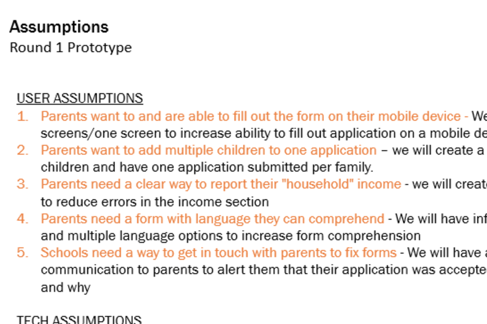
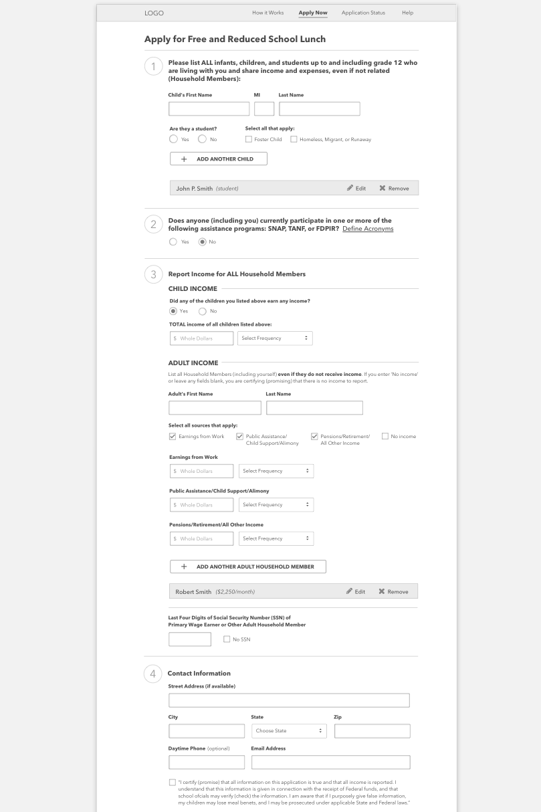

# Our Whole Story
— "How to Rapidly Prototype a Modern Digital Solution in __7 Working-sesions__ Over __3 Weeks__"

###### [ [BACK HOME](../README.md) ]

---------------------------------------------------------------------------

### *TABLE OF CONTENTS*
1.	__LEARN__: [Defining the Challenge](#defining-the-challenge)
2.	__LEARN__: [Building Empathy](#building-empathy)
3.	__IDEATE__: [Generating Ideas from Insights](#generating-ideas-from-insights)
4.	__MAKE__: [Mapping out Our Solution](#mapping-out-our-solution)
5.	__MAKE__: [First Round of Wireframes](#first-round-of-wireframes)
6.	__CHECK__: [Validating Ideas with Users](#validating-ideas-with-users)
7.	__MAKE__: [Iteration 2 Mockups](#iteration-2-mockups)
8.	__IDEATE + MAKE__: [Minimum Viable Prototype](#minimum-viable-prototype) 
9.	__MAKE__: [DevOps to Drive Learning](#devops-to-drive-learning)
10.	__CHECK__: [Usability Testing](#usability-testing)

---------------------------------------------------------------------------

### Human-Centered Design + Rapid Prototyping = Solutions for Humans

Our work was completed in seven working sessions over three weeks. When you’re moving as quickly as we did, it’s important to bring a diverse team together to quickly build trust and create common ground. To do so, we held a **project kickoff** as our first iteration of the application. Our team of product managers, technologists, consultants, user experience experts, designers, storytellers, and researchers came together for an intense day of collaboration, ideas, and emotions.

We worked closely throughout the project, using a human-centered design approach focused on **identifying user needs as a starting point to product development.** Our iterative process involved rapid prototyping and can be divided into four phases: __LEARN, IDEATE, MAKE, and CHECK__.

----------------------------------------------------------------------------------------------------------------------------------------------------------------------------------------------------------------------------------------------------------------------------------
# Defining the Challenge

We kicked off the project by establishing ground rules and going over the requirements of the competition. Once goals were defined, we brainstormed about target audiences and what would provide value in a Visioning Session, which was designed like a Mad Lib:

___I am a `target user` who needs `insert needs` so that I can `emotional benefit.` This form is different because `key differentiator.`___

The Visioning Session resulted in two project charters and a challenge brief that defined our area for experimentation around user needs. Our two target audiences were school administrators and parents.  

Below is an image of the Challenge Brief that we created to align on our scope, constraints, target users, and expected outcomes. The Challenge brief can change as we learn more from our prototypes. 

Once we defined what we were making, we drafted assumptions that we planned to test in our research. Assumption testing focuses on identifying the parts of our concept that we think are essential. 

###### [ [TOP](#) | [BACK HOME](../README.md) ]

----------------------------------------------------------------------------------------------------------------------------------------------------------------------------------------------------------------------------------------------------------------------------------
# Building Empathy

Armed with our hypotheses and existing knowledge, we created a journey map for the parent and the school administrator. The map resulted in the identification of pain points, areas where design and engineering could come together to improve the user experience. We journey map because we tend to misjudge what users want. Journey mapping gets us closer to user problems and frustrations. Below is what the current state journey map looked like for the school administrator and parent: 

Next, we created the first draft of our personas, or characterizations that represent end users. We split into two teams and sketched personas, which enabled us to generate ideas that would meet the needs of the users. We created Run-down Ronaldo, a single dad who is trying to raise a family on little income, and Frazzled Phyllis, a school administrator that is over-worked and short on time. Establishing personas at this phase of the project ensures that we are creating a solution for our end-users. 

Most of the population that we were designing for were using mobile devices to access the internet. We used Bootstrap to develop our solution because it provided a robust grid system and pre-styled HTML elements that enabled us to quickly and effectively make a website that is responsive to multiple devices. 

Next, team members conducted fieldwork to gather insight into how school lunch programs work. We cold-called three school district administrators from different geographic areas and had conversations with friends and family who work in schools. 
In our interviews, we weren’t surprised to hear that school administrators preferred online applications to paper versions, both in terms of accuracy and collection ease. Here is what they said:

"Online runs smoother because [the application] does not allow parents to proceed without filling out all application [fields]." - Cathy (Austin School District)

“Online is definitely better... The paper ones, we scan them also. [However,] they do the wrong ink color or they leave out information. They don’t sign it or leave off a kid.” – Theresa (Tustin Unified School District)

We were surprised, however, that the current digitization effort is extremely complex and costly; often school districts in the same state use multiple vendors. Small school districts struggle to justify the cost of finding and implementing vendor applications. 
Additionally, we learned that a large part of the school admin job is follow up:

 “It’s hard to understand one economic unit when multiple families are living together. When there are two households together, then it’s hard to understand the economic unit. It’s just a lot, there is always follow up.” – Wendy (Washington State)
 
Even when translated, language is a barrier. Wendy also told us that one challenge for families is not that the application isn’t offered in their native tongue, but that the language itself is too complex, particularly for those with lower literacy levels. To solve for this, we made sure our translation into Spanish wasn’t too formal.

Based on our research, we built a refined persona for each user group around which to design:

###### [ [TOP](#) | [BACK HOME](../README.md) ]

----------------------------------------------------------------------------------------------------------------------------------------------------------------------------------------------------------------------------------------------------------------------------------
# Generating Ideas from Insights

**Why are people misreporting? How can we encourage accurate reporting?**
We set up our brainstorming session so that we could break away from groupthink. We divided into three teams and brainstormed, using our Challenge Brief and Personas to inspires ideas. Our ideation session had both technical input from our development team, design input from our designers, client input from a subject matter expert who had worked with USDA, as well as product and user input. 

Our small groups presented each of their concepts to the larger team and continued our brainstorm by externalizing ideas on the wall using sticky notes. After discussing the benefits and drawbacks of different approaches, we decided to make two versions of the website design: a Wizard and a Single Scroll.

###### [ [TOP](#) | [BACK HOME](../README.md) ]

----------------------------------------------------------------------------------------------------------------------------------------------------------------------------------------------------------------------------------------------------------------------------------
# Mapping out Our Solution

Having gained an understanding of both Ronaldo, the head of household user, and Phyllis, the school administrator user, we brainstormed ideas big and small to meet our users’ needs and prioritized them to guide our design approach. We mapped several different screen flows and chose what we thought was the best one. At this point, we focused mostly on the users and technical feasibility,but what about USDA? We created a requirements matrix to ensure we were meeting USDA’s challenge parameters. 

###### [ [TOP](#) | [BACK HOME](../README.md) ]

----------------------------------------------------------------------------------------------------------------------------------------------------------------------------------------------------------------------------------------------------------------------------------
# First Round of Wireframes

Once the application flow was established, the design team created two prototypes, using the same flow and content—a single scroll form and a Wizard form. Our philosophy is to test concepts early and often. In order to test which format would be the most easy to use, we set up an A/B test with 20 respondents for our first point of validation. This helped us determine which design approach was the most effective, and reduce the risk of creating something that is difficult to use. 

###### [ [TOP](#) | [BACK HOME](../README.md) ]

----------------------------------------------------------------------------------------------------------------------------------------------------------------------------------------------------------------------------------------------------------------------------------
# Validating Ideas with Users

FIXMECollaboratively administrate empowered markets via plug-and-play networks. Dynamically procrastinate B2C users after installed base benefits. Dramatically visualize customer directed convergence without revolutionary ROI.

Efficiently unleash cross-media information without cross-media value. Quickly maximize timely deliverables for real-time schemas. Dramatically maintain clicks-and-mortar solutions without functional solutions.

Completely synergize resource taxing relationships via premier niche markets. Professionally cultivate one-to-one customer service with robust ideas. Dynamically innovate resource-leveling customer service for state of the art customer service.

###### [ [TOP](#) | [BACK HOME](../README.md) ]

----------------------------------------------------------------------------------------------------------------------------------------------------------------------------------------------------------------------------------------------------------------------------------
# Iteration 2 Mockups

FIXMECollaboratively administrate empowered markets via plug-and-play networks. Dynamically procrastinate B2C users after installed base benefits. Dramatically visualize customer directed convergence without revolutionary ROI.

Efficiently unleash cross-media information without cross-media value. Quickly maximize timely deliverables for real-time schemas. Dramatically maintain clicks-and-mortar solutions without functional solutions.

Completely synergize resource taxing relationships via premier niche markets. Professionally cultivate one-to-one customer service with robust ideas. Dynamically innovate resource-leveling customer service for state of the art customer service.

###### [ [TOP](#) | [BACK HOME](../README.md) ]

----------------------------------------------------------------------------------------------------------------------------------------------------------------------------------------------------------------------------------------------------------------------------------
# Minimum Viable Prototype

FIXMECollaboratively administrate empowered markets via plug-and-play networks. Dynamically procrastinate B2C users after installed base benefits. Dramatically visualize customer directed convergence without revolutionary ROI.

Efficiently unleash cross-media information without cross-media value. Quickly maximize timely deliverables for real-time schemas. Dramatically maintain clicks-and-mortar solutions without functional solutions.

Completely synergize resource taxing relationships via premier niche markets. Professionally cultivate one-to-one customer service with robust ideas. Dynamically innovate resource-leveling customer service for state of the art customer service.

###### [ [TOP](#) | [BACK HOME](../README.md) ]

----------------------------------------------------------------------------------------------------------------------------------------------------------------------------------------------------------------------------------------------------------------------------------
# DevOps to Drive Learning

FIXMECollaboratively administrate empowered markets via plug-and-play networks. Dynamically procrastinate B2C users after installed base benefits. Dramatically visualize customer directed convergence without revolutionary ROI.

Efficiently unleash cross-media information without cross-media value. Quickly maximize timely deliverables for real-time schemas. Dramatically maintain clicks-and-mortar solutions without functional solutions.

Completely synergize resource taxing relationships via premier niche markets. Professionally cultivate one-to-one customer service with robust ideas. Dynamically innovate resource-leveling customer service for state of the art customer service.

###### [ [TOP](#) | [BACK HOME](../README.md) ]

----------------------------------------------------------------------------------------------------------------------------------------------------------------------------------------------------------------------------------------------------------------------------------
# Usability Testing

FIXMECollaboratively administrate empowered markets via plug-and-play networks. Dynamically procrastinate B2C users after installed base benefits. Dramatically visualize customer directed convergence without revolutionary ROI.

Efficiently unleash cross-media information without cross-media value. Quickly maximize timely deliverables for real-time schemas. Dramatically maintain clicks-and-mortar solutions without functional solutions.

Completely synergize resource taxing relationships via premier niche markets. Professionally cultivate one-to-one customer service with robust ideas. Dynamically innovate resource-leveling customer service for state of the art customer service.

###### [ [TOP](#) | [BACK HOME](../README.md) ]

----------------------------------------------------------------------------------------------------------------------------------------------------------------------------------------------------------------------------------------------------------------------------------
----------------------------------------------------------------------------------------------------------------------------------------------------------------------------------------------------------------------------------------------------------------------------------

