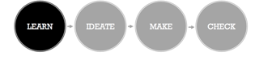

# Our Whole Story
— "How to Rapidly Prototype a Modern Digital Solution in __7 Working-sesions__ Over __3 Weeks__"

###### [ [BACK HOME](../README.md) ]

---------------------------------------------------------------------------

### *TABLE OF CONTENTS*
1.	__LEARN__: [Designing with Intent](#designing-with-intent)
2.	__LEARN__: [Building Empathy](#building-empathy)
3.	__IDEATE__: [Generating Ideas from Insights](#generating-ideas-from-insights)
4.	__MAKE__: [Mapping out Our Solution](#mapping-out-our-solution)
5.	__MAKE__: [First Round of Wireframes](#first-round-of-wireframes)
6.	__CHECK__: [Validating Ideas with Users](#validating-ideas-with-users)
7.	__MAKE__: [Iteration 2 Mockups](#iteration-2-mockups)
8.	__IDEATE + MAKE__: [Minimum Viable Prototype](#minimum-viable-prototype) 
9.	__MAKE__: [DevOps to Drive Learning](#devops-to-drive-learning)
10.	__CHECK__: [Usability Testing](#usability-testing)

---------------------------------------------------------------------------

### Human-Centered Design + Rapid Prototyping = Solutions for Humans

Our work was completed in seven working sessions over three weeks. When you’re moving as quickly as we did, it’s important to bring a team together to quickly build trust and create common ground. To do so, we held a **project kickoff.** In the kickoff we created our first iteration of the application. Our team of product managers, technologists, consultants, user experience experts, designers, storytellers, and researchers came together for an intense day of collaboration and ideas.

We worked closely throughout the project, using a human-centered design approach focused on **identifying user needs as a starting point to product development.** Our iterative process involved rapid prototyping and can be divided into four phases: __LEARN, IDEATE, MAKE, and CHECK__.

----------------------------------------------------------------------------------------------------------------------------------------------------------------------------------------------------------------------------------------------------------------------------------
# Designing with Intent

In the project kickoff we established ground rules and went over the challenge requirements. From there, we brainstormed our target audiences, their needs, and what emotional benefit our form might provide. We designed this activity like a Mad Lib:

___I am a `target user` who needs `insert needs` so that I can `emotional benefit.` This form is different because `key differentiator.`___

The Visioning Session resulted in two project charters and a challenge brief that defined our area for experimentation. Our two target audiences were school administrators and parents.  

Below is an image of the Challenge Brief that we created to align on our scope, constraints, target users, and expected outcomes. The Challenge brief can change as we learn more from our prototypes. 

###### [ [TOP](#) | [BACK HOME](../README.md) ]

----------------------------------------------------------------------------------------------------------------------------------------------------------------------------------------------------------------------------------------------------------------------------------
# Building Empathy

Armed with our hypotheses and existing knowledge, we created a journey map for the parent and the school administrator. A journey map looks at the **emotional journey of applying for meals.** What are our stakeholders doing before, during, and after the application process? The map resulted in the identification of pain points, areas where design and engineering could come together to improve the user experience. Journey mapping gets us closer to user problems and frustrations. Below is what the current state journey map looked like for the school administrator and parent: 

Next, we created the first draft of our personas, or archetypes that represent end users. We split into two teams and sketched personas, which enabled us to generate ideas that would meet the needs of the users. We created Run-down Ronaldo, a single dad who is trying to raise a family on little income, and Frazzled Phyllis, a school administrator that is over-worked and short on time. Check out our fine artwork:

If we were Rondalo, where would we be filling out this form? Maybe on our home computer, perhaps at a public library, but mostly, we found this population accesses the internet from their mobile device. So we used Bootstrap to develop our solution. It provided a robust grid system and pre-styled HTML elements that enabled us to quickly and effectively make a website that is responsive to multiple devices. 

**Interviews**
Next, team members conducted fieldwork to gather insight into how school meal applications work. We cold-called three school district administrators from around the country and had conversations with friends and family who work in schools. 
In our interviews, we weren’t surprised to hear that school administrators preferred online applications to paper versions, both in terms of accuracy and collection ease. Here is what they said:

"Online runs smoother because [the application] does not allow parents to proceed without filling out all application [fields]." - Cathy (Austin School District)

“Online is definitely better... The paper ones, we scan them also. [However,] they do the wrong ink color or they leave out information. They don’t sign it or leave off a kid.” – Theresa (Tustin Unified School District)

We were surprised, however, that the current digitization effort is extremely complex and costly; often school districts in the same state use multiple vendors. Small school districts struggle to justify the cost of finding and implementing vendor applications. 

Additionally, we learned that a large part of the school admin job is follow up:

 “It’s hard to understand one economic unit when multiple families are living together. When there are two households together, then it’s hard to understand the economic unit. It’s just a lot, there is always follow up.” – Wendy (Washington State)
 
Wendy also told us that one challenge for families is not that the application isn’t offered in their native tongue, but that the language itself is too complex, particularly for those with lower literacy levels. To solve for this, we made sure our translation into Spanish wasn’t too formal.

After our round of research, we built a refined persona for each user group around which to design:

###### [ [TOP](#) | [BACK HOME](../README.md) ]

----------------------------------------------------------------------------------------------------------------------------------------------------------------------------------------------------------------------------------------------------------------------------------
# Generating Ideas from Insights

**Why are people misreporting? How can we encourage accurate reporting?**
We set up our brainstorming session so that we could break away from groupthink. We divided into three teams and brainstormed, using our Challenge Brief and Personas to inspires ideas. Our ideation session had both technical input from our development team, design input from our designers, client input from a subject matter expert who had worked with USDA, as well as product and user input. 

Our small groups presented each of their concepts to the larger team and continued our brainstorm by externalizing ideas on the wall using sticky notes. After discussing the benefits and drawbacks of different approaches, we decided to make two versions of the website design: a Wizard and a Single Scroll.

###### [ [TOP](#) | [BACK HOME](../README.md) ]

----------------------------------------------------------------------------------------------------------------------------------------------------------------------------------------------------------------------------------------------------------------------------------
# Mapping out Our Solution

Having gained an understanding of both Ronaldo, the head of household user, and Phyllis, the school administrator user, we brainstormed ideas big and small to meet our users’ needs and prioritized them to guide our design approach. We mapped several different screen flows and chose what we thought was the best one. At this point, we focused mostly on the users and technical feasibility,but what about USDA? We created a requirements matrix to ensure we were meeting USDA’s challenge parameters. 

###### [ [TOP](#) | [BACK HOME](../README.md) ]

----------------------------------------------------------------------------------------------------------------------------------------------------------------------------------------------------------------------------------------------------------------------------------
# First Round of Wireframes

Once the application flow was established, the design team created two prototypes, using the same flow and content—a single scroll form and a Wizard form. Our philosophy is to test concepts early and often. In order to test which format would be the most easy to use, we set up an A/B test with 20 respondents for our first point of validation. This helped us determine which design approach was the most effective, and reduce the risk of creating something that is difficult to use. 

###### [ [TOP](#) | [BACK HOME](../README.md) ]

----------------------------------------------------------------------------------------------------------------------------------------------------------------------------------------------------------------------------------------------------------------------------------
# Validating Ideas with Users

We shared a link to the mockups using InVision and had friends, family, and our target user groups give us high-level feedback on functionality and usability. Additionally, we included an A/B test to determine whether our audience preferred the wizard format or single scrolling page:

When the feedback rolled in from 20 testers, we expected the wizard version to win the test hands down. To our surprise, respondents voted both formats equally! With a 50% split of the votes, we came together to critique the mockups and align on what we learned. We used the prompts, “I like….I wish…I wonder,” to surface trends in our data. 

###### [ [TOP](#) | [BACK HOME](../README.md) ]

----------------------------------------------------------------------------------------------------------------------------------------------------------------------------------------------------------------------------------------------------------------------------------
# Iteration 2 Mockups

From these trends, we combined the best elements of each original prototype to come up with our next iteration: a high fidelity mockup that shared elements of a single scroll and a wizard. In the design process, **making is thinking.** In creating the new version of our form we knew we needed to check our flow. We went back to the requirements matrix and defined three different flows/skip patterns for the parent:

Here is a version we made a day later:

###### [ [TOP](#) | [BACK HOME](../README.md) ]

----------------------------------------------------------------------------------------------------------------------------------------------------------------------------------------------------------------------------------------------------------------------------------
# Minimum Viable Prototype

Our new flow inspired a few additions to the wirefreams. The first is shown in a sketch below. In an effort to narrow down the number of steps and flows we show all the scenarios on one page. We went from **low-fiedlity...**

**To high fidelity...**

The second addition was the introduction of a modal screen for adult and children income. Our intention here was to reduce the amount of information on one screen. 

In two days we went from **low-fidelity...**

To **high-fidelity**

In rapid prototyping, nothing you make is perfect, but everything you make is an opportunity to learn. During the process, everything from the design to the language of the form continuously evolved. We introduced interactive features, such as an orange <?> button to solve this design challenge and promote accurate reporting.  

Below is an example of the language evolution of the form. In constructing our words, we considered different levesl of digital literacy and how we might reduce the stigma of filling out the form. By giving examples in the instructional text we get rid of the social bias that families are always related. We hope that this will decrease the number of reporting errors due to household size. 

As a team, we went through each screen to make edits in lanauge and check against requirements one more time. 

###### [ [TOP](#) | [BACK HOME](../README.md) ]

----------------------------------------------------------------------------------------------------------------------------------------------------------------------------------------------------------------------------------------------------------------------------------
# DevOps to Drive Learning

DevOps is the process that enables us to build, test, and learn. Rather than a more traditional monthly release schedule, we shortened our learning cycle to minutes. We used Amazon Web Services, Elastic Beanstalk, AWS CodePipeline, GitHub, and Trello to enable this rapid learning and team communication. 

###### [ [TOP](#) | [BACK HOME](../README.md) ]

----------------------------------------------------------------------------------------------------------------------------------------------------------------------------------------------------------------------------------------------------------------------------------
# Usability Testing

With a functional prototype, we were excited to learn how people like Ronaldo and Phyllis interact with our form. We created a research plan for interviews. Due to time constraints, we chose to leverage an online platform, UserTesting.com, to conduct a remote unmoderated test. We created a screener targeting a population that had low-computer literacy in order to test whether the interface was easy to use. We used the Lean Research plan template to prioritize what we wanted to learn and what we wanted to ask. Here is the test scenario we created:

We conducted a few in-person moderated tests. We learned about communication preferences and gained some insight about how people look for information. Here are some quotes:

**"I'd prefer if you text me because I don't have a computer."**
**"If there is information I need to know, you don't want to hide it (behind a menu)."**

In one test, Lucinda, a 43 year-old single mother of two, filled out the adult income and clicked, "save." She wanted to go back to make edits and was confused about how to go back to our modal box. She asked out loud, "How do I get back to income?" The design team changed some language on the form to make the functionality more clear. Here is the questionnaire that she filled out after her test:

To learn a little more, we set up a test on **usertesting.com** to test five people with low computer literacy in an unmoderated usability test. 

###### [ [TOP](#) | [BACK HOME](../README.md) ]

----------------------------------------------------------------------------------------------------------------------------------------------------------------------------------------------------------------------------------------------------------------------------------
----------------------------------------------------------------------------------------------------------------------------------------------------------------------------------------------------------------------------------------------------------------------------------

