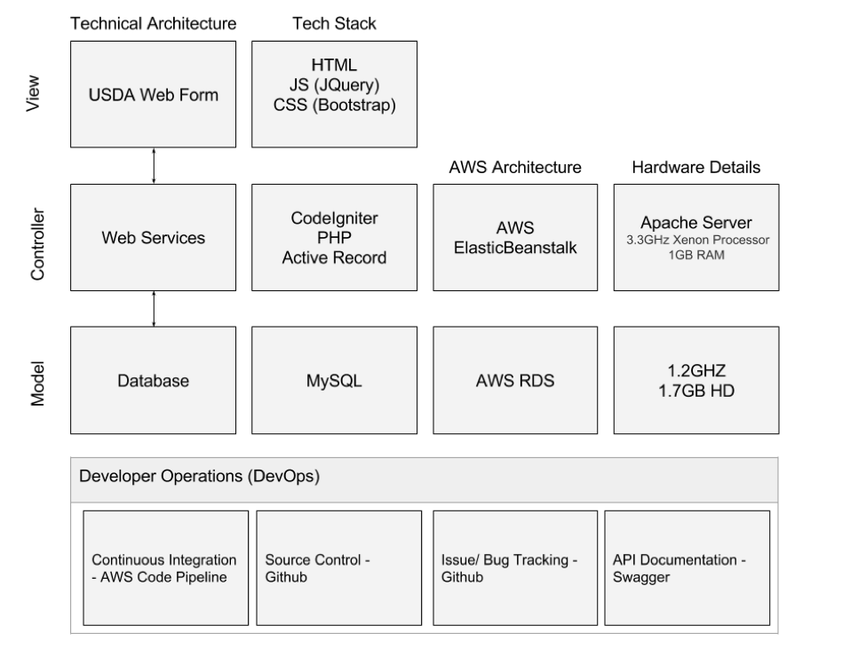
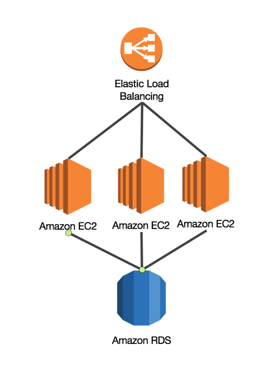

# Technical Guide

###### [ [BACK HOME](../README.md) ]


## Approach
We used all open source technologies and open sourced library for our LunchBox prototype. It was built using a technical stack and architecture that is easily installed and deployed across different environment. It uses popular technical frameworks and open source technology to ensure that organizations are able to integrate the solution with their existing products. The application follows the widely addopted model-view-controller (MVC) architecture and cloud infrastructure.



## Dependencies
The application was designed on a LAMP (Linux Apache MySql PHP) stack using the standard model-view-controller architecture. The following collection lists the libraries and technology within each of those areas and their purpose within our application.

We manage all of our dependencies through Composer. The versions are located in the `composer.json` file at the root directory. Running `php composer.phar install` will install all the dependencies needed other than the MySql database.

- **Codeigniter (v3.0.4):** _PHP web application framework_ - [License](https://github.com/bcit-ci/CodeIgniter/blob/develop/user_guide_src/source/license.rst)
	- Resource: [Documentation](https://codeigniter.com/)	
- **Twitter Bootstrap (v3.3):** _Responsive CSS Framework and front-end library_ - [License](http://getbootstrap.com/getting-started/#license-faqs)
	- Resource: [Documentation](http://getbootstrap.com/)

- **JQuery (v2.2):** - _JavaScript library for event handling_ - [License](https://jquery.org/license/)
	- Resource: [Documentation](https://jquery.com/)

- **MySql (v5.6.26):** _Database_ - [License](http://www.mysql.com/about/legal/)
	- [Installation instructions](http://www.mysql.com/downloads/)

#### Optional Supporting Services
- **Google Analytics:** _User Behavior and Usage Tracking_ - [Link](https://www.google.com/analytics/)
- **Elevio:** _Live User Support & Interactive On-Screen Help Guide_ - [Link](https://elev.io/)
- **UserVoice:** _Product Management & Customer Support Ticketing_ - [Link](https://www.uservoice.com/)

###### [ [TOP](#) | [BACK HOME](../README.md) ]


## Scalable Cloud Architecture w/ DevOps
The application is hosted on the Amazon Web Services, and the architecture has been designed specifically to support the scalability and reliability that the cloud provides. Below are the following Amazon resources and services that our team used to both build a stable application as well as increase the pace of development.

- __Amazon EC2: web service that provides resizable compute capacity__
  -	Purpose: EC2 hosts our application, and depending on the load of the users to the site, they can scale up automatically to account for the additional traffic and workload

- __Amazon Elastic Load Balancer: load balancer that redirects traffic to EC2 instance for a consistent application performance__
  -	Purpose: ELB distributes the traffic of our application and monitors the health of other application instance

- __Amazon RDS: relational and scalable database__
  -	Purpose: A separated database hosted in the cloud is able to scale automatically based on the amount of in data in our application and replicated to ensure backups.

- __Amazon CodePipeline: continuous delivery service for fast and reliable application updates__
  -	Purpose: CodePipeline enables our team to automatically test and deploy updates according to our code repository. This has enabled much faster and reliable deployment to the environment and has saved the team developer time. 

 

###### [ [TOP](#) | [BACK HOME](../README.md) ]


## Installation (Local)

1. [Install Composer](https://getcomposer.org/doc/00-intro.md)
2. [Install MAMP](https://documentation.mamp.info/en/documentation/mamp/) (Lamp for Windows) or any Apache Server
	3. 	Load the root directory of the application into the document root and start the server
3. Open Terminal and navigate to the root of the repository
3. Run `php composer.phar install` to download all the libraries needed for the application
4. Configure database and server variables
	* Set the `base_url` in `config/config.php` to your root url
	* Load the base MySql Database template into a local database. You can file the template database at `documentation/usda_eat_2016-02-27.sql`
	
	```	
	$db['default'] = array(
	'dsn'	=> '',
	'hostname' => DB_HOSTNAME,
	'username' => DB_USERNAME,
	'password' => DB_PASSWORD,
	'database' => DB_DATABASE,
	'dbdriver' => 'mysqli',
	'dbprefix' => '',
	'pconnect' => FALSE,
	'db_debug' => (ENVIRONMENT !== 'production'),
	'cache_on' => FALSE,
	'cachedir' => '',
	'char_set' => 'utf8',
	'dbcollat' => 'utf8_general_ci',
	'swap_pre' => '',
	'encrypt' => FALSE,
	'compress' => FALSE,
	'stricton' => FALSE,
	'failover' => array(),
		'save_queries' => TRUE
	);
	```
	7. Add database configurations into `config/database.php`
	
	```	
	$config['base_url'] = "usda/";
	```

5. Start Apache Server and navigate to your defined url `example http://usda/`

###### [ [TOP](#) | [BACK HOME](../README.md) ]


## Configuration
Lunchbox has been designed with purpose of being configured for specifically to the look and feel of your school district's applications. Feel free to edit the colors settings in the `assets/css/app.scss` file to align with your application. 

###### [ [TOP](#) | [BACK HOME](../README.md) ]

## Exporting Data
To capture the data collected through the application. Run the following sql query to capture all the relevant data across the application, household_members, and household_student tables.

An example of the output from the query can be found at the following link: [Example Export](applications_export_example.csv)

```
SELECT *
FROM applications
INNER JOIN household_members
ON applications.id=household_members.application_id
INNER JOIN household_students
ON applications.id=household_students.application_id;
```
###### [ [TOP](#) | [BACK HOME](../README.md) ]

## AWS Cloud Deployment
The application has been deployed and designed for use with Amazon Web Services' Elastic Beanstalk service for easy and scalability. In the situation that you need to deploy it in a different manner, the database can be hosted along with the rest of the application on the same server if necessary. This approach can be accomplished using AWS' EC2 service.

To deploy into Elastic Beanstalk, please reference the following documentation: [Configuring PHP Environments with Elastic Beanstalk](http://docs.aws.amazon.com/elasticbeanstalk/latest/dg/create_deploy_PHP.container.html)

To use dedicated EC2 servers, please reference the following documentation: [Installing a Lamp Web Server on Amazon Linux](http://docs.aws.amazon.com/AWSEC2/latest/UserGuide/install-LAMP.html)

*For other type of cloud or private datacenter deployments, the EC2 server documentation will be the most useful*

###### [ [TOP](#) | [BACK HOME](../README.md) ]


